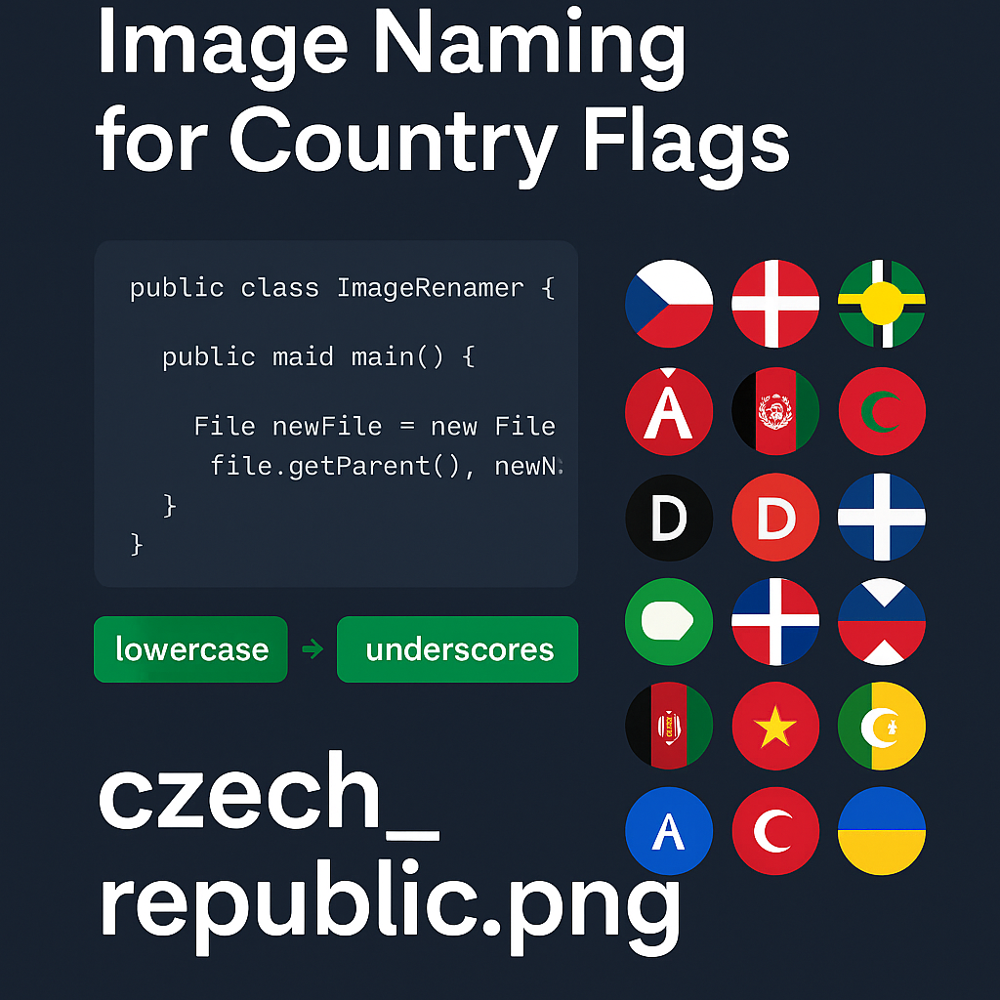
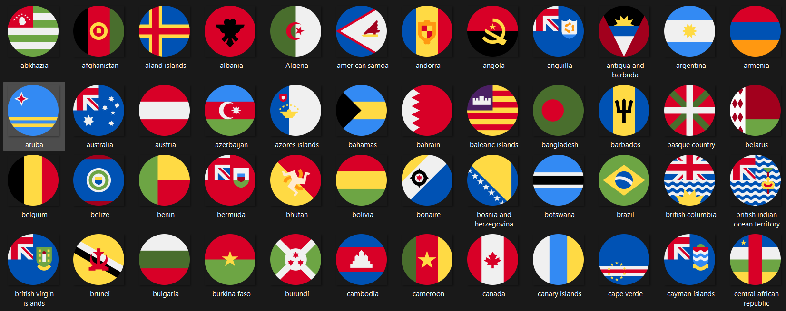
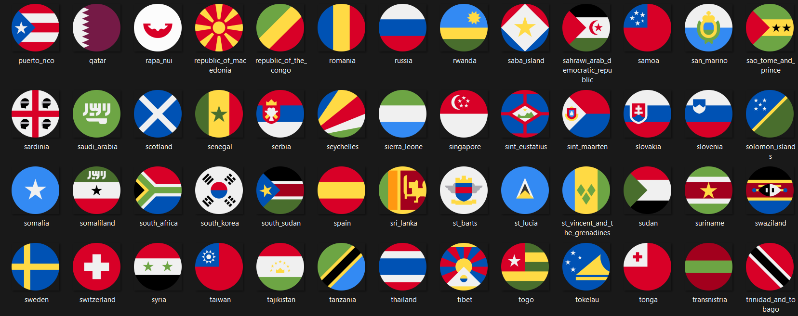

<p align="center">
  
</p>

<h1 align="center">🇺🇳 Flag File Normalizer</h1>
<p align="center">
  <b>From inconsistent naming to perfectly standardized flag files</b><br>
  <sub>Transform "United Kingdom.png" → "united_kingdom.png" with one command</sub>
</p>

---

## 🚀 How to Run

### Prerequisitess
- Java Development Kit (JDK) 8 or higher
- Command line terminal (PowerShell, Command Prompt, or Terminal)

### Step-by-Step Guide

1. **Download the Tool**
   ```bash
   git clone https://github.com/SalmanKhanB/image-renamer.git
   cd image-renamer
   ```

2. **Prepare Your Images**
   - Create a folder for your images (e.g., `folder/`)
   - Place all your flag images in this folder
   - Supported formats: PNG, SVG, JPG, WebP

3. **Run and Execute**
   ```bash
   # Compile the program
   javac ImageRenamer.java
   
   # Run the program
   java ImageRenamer
   ```

   The program will:
   1. Ask you to enter the directory path containing your images
   2. Process all image files in that directory
   3. Show progress as it renames files
   4. Display a summary when complete

   Example output:
   ```
   Enter the directory path containing images:
   C:/Users/YourName/Pictures/flags
   Processing files in: C:/Users/YourName/Pictures/flags
   ✔ Renamed: United States.png → united_states.png
   ✔ Renamed: South Korea.jpg → south_korea.jpg
   ✔ Renamed: Côte d'Ivoire.gif → cote_d_ivoire.gif
   
   ✅ Process completed: 3 files renamed
   ```

   Note: You can also provide the directory path directly as a command-line argument:
   ```bash
   java ImageRenamer "C:/Users/YourName/Pictures/flags"
   ```


## 🚀 How It Works

Processing flag images...

✔ Renamed: "United States.png" → "united_states.png"

✔ Renamed: "South Korea.jpg" → "south_korea.jpg"

✔ Renamed: "Côte d'Ivoire.gif" → "cote_d_ivoire.gif"
 

## 🧠 Use Cases

### 🎯 Perfect for:

#### 🟢 Mobile & Web Development
- **Android Development**
  - Prepare `res/drawable/` folders for Android Studio
  - Standardize asset names for Material Design components
  - Batch process app icons and splash screens

- **Flutter Projects**
  - Organize assets in `assets/` directory
  - Normalize image names for pubspec.yaml
  - Prepare consistent asset references

- **React Native**
  - Standardize image imports
  - Normalize asset names for require() statements
  - Prepare consistent image references

#### 🧩 Design & Development Workflow
- **Dev-Design Handoff**
  - Convert design asset names to developer-friendly format
  - Maintain consistent naming across design tools (Figma, Sketch)
  - Streamline asset delivery process

#### 📦 Asset Management
- **UI Component Libraries**
  - Batch cleanup for scalable UI projects
  - Standardize icon collections
  - Prepare consistent asset packages

- **Country Flag Collections**
  - Normalize flag image names
  - Prepare flag sets for internationalization
  - Create consistent flag libraries

- **Icon Libraries**
  - Standardize icon naming conventions
  - Prepare icon sets for various platforms
  - Create consistent icon packages

### 💡 Benefits
- **Time Saving**: Process hundreds of files in seconds
- **Consistency**: Maintain uniform naming across projects
- **Error Prevention**: Eliminate naming-related bugs
- **Better Organization**: Create clean, predictable file structures

## 📸 Visual Transformation

### Before: Mixed Format Chaos


Common issues fixed:
- Random capitalization ("Algeria" vs "belarus")
- Spaces in filenames ("aland islands")
- Inconsistent extensions (".PNG" vs ".jpg")

### After: Perfect Consistency


Results you get:
- Uniform lowercase ("austria" not "Austria")
- Spaces → underscores ("british_virgin_islands")
- Standardized extensions (all .png)

---
## 👨‍💻 About the Developer

Created by [Salman Khan](https://www.linkedin.com/in/salman-khan-458489154/) 
